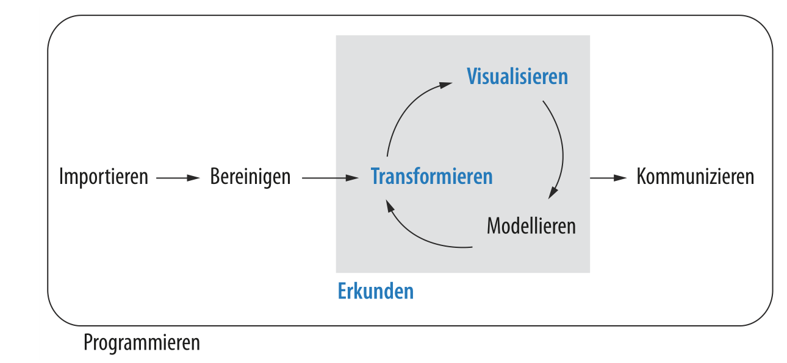
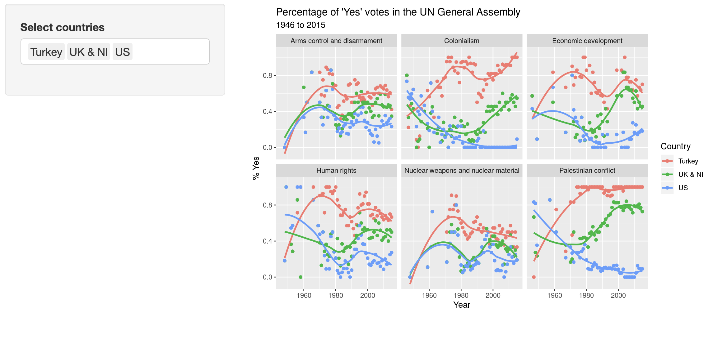
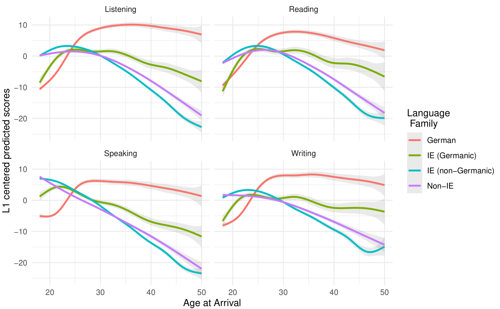

```{r child = "../setup.Rmd"}
```

```{r packages, echo=FALSE, message=FALSE, warning=FALSE}
library(tidyverse)
```


```{r fig.align="center", echo=FALSE, alt="Ill", out.width="60%"}
knitr::include_graphics("https://raw.githubusercontent.com/allisonhorst/stats-illustrations/master/rstats-artwork/r_first_then.png")
```

---

## What is Data Science in Education?

--

```{r fig.align="center", echo=FALSE, alt="Pipeline", out.width="100%"}

```


---

# What is this course?

- An introduction to exploratory data analysis 
- (which overlaps a lot with data science and statistics)
- All the steps in the data analysis process from beginning to end 
- (instead of focusing on a particular statistical method)

--

**Q - What background does this course assume?**  
A - None.

--

**Q - Is this an intro statistics course?**  
A - The course is practical and focuses more on data analysis and visualization but we will apply many tools from statistics. 

--

**Q - Do we need to program?**   
A - Yes, we will use R instead of a point-and-click interface.


---

## Where can I find infor for this course?

<br><br><br><br>

.large[
.center[
Moodle and [jobschepens.github.io/DIDB](https://jobschepens.github.io/DIDB/syllabus.html)
]
]

---

## Who am I?

.pull-left[
```{r fig.align="center", echo=FALSE, alt="Mine", out.width="70%"}

```
]
.pull-right[
.midi[
- **Email:** job.schepens@tu-dortmund.de]
]

---

class: center, middle

# Interesting examples of exploratory data analyses

---


## Online science class data

```{r echo=FALSE, alt="class", out.width="70%"}
knitr::include_graphics("https://datascienceineducation.com/07-wt-ed-ds-pipeline_files/figure-html/fig7-3-1.png")
```

Estrellado et al. (in press). Data science in education using R. Routledge.

---

## Aggregrate school data

```{r echo=FALSE, alt="school", out.width="70%"}
knitr::include_graphics("https://datascienceineducation.com/09-wt-aggregate-data_files/figure-html/fig9-4-1.png")
```

Estrellado et al. (in press). Data science in education using R. Routledge.

---

## Longitudinal data

```{r echo=FALSE, alt="long", out.width="70%"}
knitr::include_graphics("https://datascienceineducation.com/10-wt-longitudinal-analysis_files/figure-html/fig10-9-1.png")
```

Estrellado et al. (in press). Data science in education using R. Routledge.

---

# Text analysis of Trump's tweets

```{r fig.align="center", echo=FALSE, alt="Trump tweets", out.width="63%"}
knitr::include_graphics("img/david-robinson-trump-tweets.png")
```

David Robinson, [varianceexplained.org/r/trump-tweets](http://varianceexplained.org/r/trump-tweets)

---

## Voting patterns in the UN

```{r echo=FALSE, alt="UN Votes", out.width="100%"}

```

[minecr.shinyapps.io/unvotes](https://minecr.shinyapps.io/unvotes/)

---

## Immigrants learning Dutch as an additional language

```{r echo=FALSE, alt="STEX", out.width="70%"}

```

Schepens et al., in preperation

---

class: middle

# Paired discussion

- Learning to use R can be daunting 
- Solving problems can be annoying
- Beginning is difficult
- Experts are intimidating

```{r echo=FALSE}
# library(countdown)
# countdown(minutes = 5)
```

---

# Focus

- Research integrity
  - Questionable research practices, open access, P-hacking?
- Research principles
  - Study design, measurement, sampling, statistics
- Dissemination
  - Presentation
  - Writing structure, from broad to specific to broad

---

## Quality

- Description of the state-of-the-art? 
- Methods 
- Originality / What is the contribution? 
- Interdisciplinarity? 
- Gender dimension

---

## Impact

- Measures to disseminate to scientific community, industry, professional organizations, policy makers, etc. 
- What about exploitation? 
- Creating awareness through public engagement activities. Outreach.
- Effective communication to public such that the research is understandable	

---

## Feasibility

- Work planning
  - Allocate tasks and resources
  - Achieve research objectives in time
- Management and risks
  - Progress monitoring
  - Contingency plans
- Institutional support
  - Logistics & facilities


---

## Peer review

- Assess novelty and substance
- Considered essential for establishing body of scientific knowledge

---

## Studienleistung

- Research
  - State-of-the-art, research gap, research question, hypotheses
  - Methods & results, 
  - Contribution, limitations, future work
- Dissemination
  - Present research proposal
  - Present research outcomes
  - Submit a research report 
  - Peer review
  - Revise manuscript
- 13 weeks

---

## Homework (due next week)

- Read the course syllabus [jobschepens.github.io/DIDB](https://jobschepens.github.io/DIDB/syllabus.html)
- Watch the lectures of week 1 of an online course on Research Methods and prepare for discussing them next week. 
  - [Coursera course "Quantitative Methods"](https://www.coursera.org/learn/quantitative-methods?specialization=social-science#syllabus) [~4 hours including quizzes]
- If you have questions, you can email me or use the Moodle forum. 


---

## Acknowledgements

<br><br><br><br>

.large[
[introds.org](https://introds.org)

[djnavarro.github.io/robust-tools](https://djnavarro.github.io/robust-tools/)

[psych10.github.io](https://psych10.github.io/)
]
