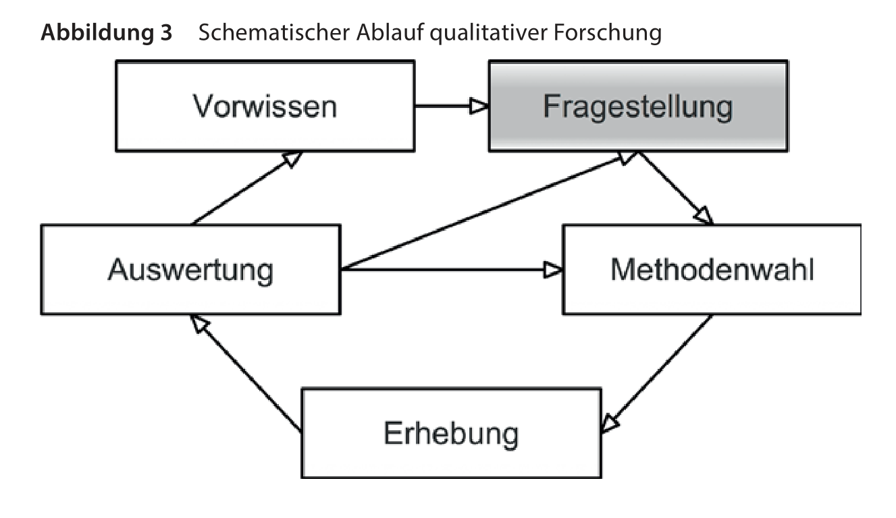
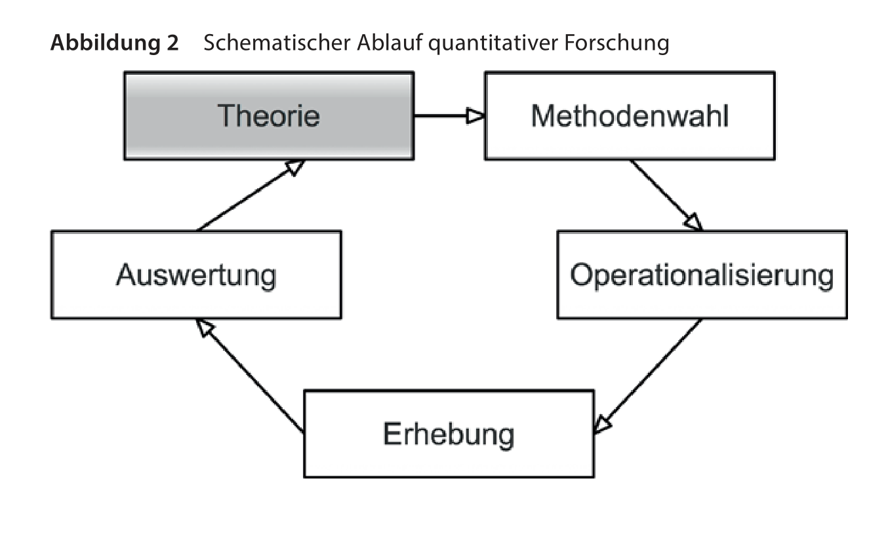

```{r child = "../setup.Rmd"}
```

## Topics

- What is quantitative research? 
- What is numerical data?
- Examples
	- How many males get a first-class degree at university compared to females?
	- What percentage of teachers and school leaders belong to ethnic minority groups?
	- Has pupil achievement in English improved in our school district over time?
- What about attitudes and beliefs? 

---

## Foundations / worldviews

- Quantitative ‘realist’ or ‘positivist’
- Qualitative: ‘subjectivist’

---

## When do we use quantitative methods?

- descriptive
	- how many x? 
	- increase / decrease? 
- inferential / explain
	- prediction
	- testing hypotheses

---

## When do we not use quantitative methods?

- depth 
- develop theories
- complex
- meaning

---


## Discussion 

1. Gender (male/female) is not a quantitative variable. Can you think of any ways you could study gender in quantitative research?

2. Learning styles (e.g. visual, audio, kinaesthetic) are not a quantitative variable. Can you think of any ways you could study learning styles in quantitative research?

3. What is your worldview (epistemology) with regard to research? Do you think it is compatible with using quantitative methods?

4. Can you think of a research question you could study using quantitative methods?

5. What kind of research question would you study using a mixed methods design?

---


## Ablauf

.pull-left[
```{r fig.align="center", echo=FALSE, alt="Mine", out.width="100%"}

```
]
.pull-right[
```{r fig.align="center", echo=FALSE, alt="Mine", out.width="100%"}

```
]

- Falsifizierung
- Glaubwürdigkeit
- Explorativ
- "Dauer"?

---


## Next week

- Write discussion points f